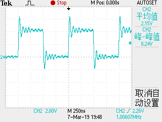
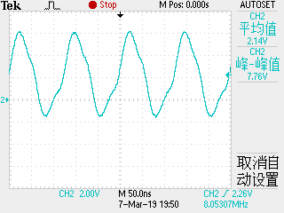
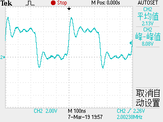
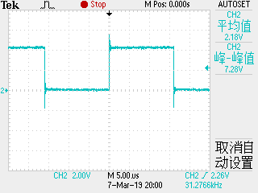

# System Clock 系统时钟

- **Clock Output Buffer：** 输出系统时钟（若分频，则输出分频后的时钟）到CLKO Pin，熔丝实现。在输出系统时钟到CLOK Pin时，对该Pin的普通操作及IO Pin操作会失效。

- PLLE位：PLLE位在PLLCSR寄存器里，在使能锁相环PLL时需要置1。

- **CLKpck可达64MHz/32MHz，SystemClock可达16MHz。**

- 内部时钟校准**OSCCAL(Oscillator Calibration Register)**

  一个pre-programmed的校准值会在复位时自动写入OSCCAL，可以通过软件写该寄存器来改变振荡器的频率。

- **使用内置振荡器时，振荡器频率决定SystemClock频率，决定EEPROM和FLASH的工作频率。若写EEPROM或FLASH，校准频率不应大于8.8MHz，否则，对EEPROM或FLASH的写操作可能失效。**

- **校准范围重叠：**

  OSCCAL Register：

  |  7   |  6   |  5   |  4   |  3   |  2   |  1   |  0   |
  | :--: | :--: | :--: | :--: | :--: | :--: | :--: | :--: |
  | CAL7 | CAL6 | CAL5 | CAL4 | CAL3 | CAL2 | CAL1 | CAL0 |
  | R/W  | R/W  | R/W  | R/W  | R/W  | R/W  | R/W  | R/W  |

  CAL7：决定振荡器两档工作频率范围，0对应最低频率，1对应最高频率。两档频率范围有重叠，即FreqOSCCAL=0X7F大于FreqOSCCAL=0X80。

  CAL[6:0]：0X00对应最低频率，0X7F对应最高频率。

- **OSCCAL调整步进：**

  任何超过现有频率2%以上的频率修改操作，都有可能造成不确定的结果，OSCCAL相邻两次修改跨度不应大于0X20。

- 改变频率时，MCU需要保持在Reset状态。

- **CLKPR(Clock Prescale Register)：**

  |   7    |  6   |  5   |  4   |   3    |   2    |   1    |   0    |
  | :----: | :--: | :--: | :--: | :----: | :----: | :----: | :----: |
  | CLKPCE |  -   |  -   |  -   | CLKPS3 | CLKPS2 | CLKPS1 | CLKPS0 |
  |  R/W   |  0   |  0   |  0   |  R/W   |  R/W   |  R/W   |  R/W   |

  CLKPR可以在MCU运行时调整系统频率。由于预分频器作用在系统时钟上，将同时影响与系统时钟同步的外围器件。

- **CLKPR中CLKPS位写操作：**
  - 第一步，同时写CLKPCE(Clock Prescaler Enable)=1，写CLKPSn=0;
  - 第二步，同时写需要的CLKPSn，写CLKPCE(Clock Prescaler Enable)=0。

- **操作预分频器时，需要确保中断被禁止，以保证操作成功。**

- 熔丝位CKDIV8默认为编程状态(Programmed=0)，此项设置将使得CLKPS=0011，即8分频。可以在软件中重新设置CLKPS而不受CKDIV8熔丝位的影响。

------

# 系统时钟设置示例

|            1MHz(8MHz,with CKDIV8=0)            |             8MHz(8MHz,with CKDIV8=1)             |
| :--------------------------------------------: | :----------------------------------------------: |
|                      |                        |
| **2MHz(8MHz,with CKDIV8=1,Division Factor=4)** | **1MHz(8MHz,with CKDIV8=1,Division Factor=256)** |
|                      |                        |

