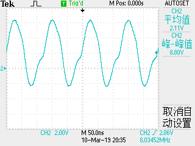
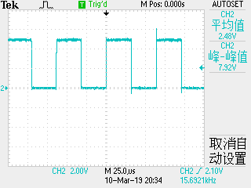
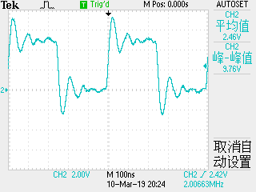

# TimerCounter0 with PWM

- **注意，Timer/Counter0的OCR0A与OCR0B功能上有所不同，对应引脚不同，配置时需要查表，认真区分。**

- 两种时钟可选，内部时钟（1、8、64、256、1024分频），外部时钟无分频。外部时钟频率不应大于（clk<sub>io</sub>/2），推荐不大于（clk<sub>io</sub>/2.5），且使用外部时钟会引入2.5至3.5个系统时钟延迟（From an edge has been applied to the T0 pin to the counter is updated.）

- 【11.4】定时器/计数器溢出中断标志位，**TOV0**是否置位，与WGM[2:0]所确定的工作模式有关。

  【11.5】比较匹配中断标志位，**OCF0A\OCF0B**，在相应中断使能的情况下，产生比较匹配中断。中断函数执行时，中断位自动清除，也可在程序中对相应引脚**I/O位**写**逻辑1**来清除。

  【11.5.1】在**非PWM**模式下，可以**强制比较匹配**，通过向**FOC0x**写**1**来实现。强制比较匹配不会置OCF0x中断位，也不会更新或清除定时器。但是引脚OC0x会产生与真实比较匹配一致的动作。该动作由**COM0[1:0]**决定。

  【11.5.2】**比较匹配阻滞。**向**TCNT0**写数据会block下一个周期的比较匹配，**这一特性使得可以在不触发中断的条件下初始化OCROx，使其值与TCNT0相等。**

  【11.5.3】**OC0x寄存器**应该在设置端口引脚所对应的方向寄存器<sub>Data Direction Register</sub>之前设置。最简单的方法是在普通模式Normal中，使用强制比较匹配，**FOC0x**，达到目的。在改变波形发生模式<sub>Waveform Generator modes</sub>时，OC0x寄存器的值不会改变。

  【11.6.1】**COM0[1:0]**改变后，相应设置将在下一次比较匹配时生效，也可以通过**强制比较匹配使之立即生效**。

  【11.7】定时器/计数器及其输出引脚的行为，由波形发生模式寄存器<sub>Waveform Generator mode</sub><sup>WGM0[2:0]</sup>、比较输出模式寄存器<sub>Compare Output Mode</sub><sup>COM0x[1:0]</sup>共同决定。比较输出模式寄存器<sub>Compare Output Mode</sub><sup>COM0x[1:0]</sup>在PWM模式中决定波形是否反转，在非PWM模式中，决定比较匹配时的输出动作，包括置位、清除和反转。

  【11.7.2】Clear Timer on Compare Match (CTC) Mode:该模式下可产生PWM波(通过设置输出模式<sub>Compare Output Mode</sub>为Toggle实现，即COM0A[1:0]=1)。**最大PWM波形频率为I/O频率的一半**（通过设置OCR0A=0x00实现）。有频率计算公式：
  <a href="https://www.codecogs.com/eqnedit.php?latex=f_{OCnx}=\frac{f_{clk\_{I/O}}}{2*N*(1&plus;OCRnx)}\quad(N\&space;variable\&space;represents\&space;the\&space;prescale\&space;factor)" target="_blank"></a>

  **该模式下有溢出中断TOV0和比较匹配中断OCF0A可用。比较匹配中断OCF0A由计数器值达到TOP而产生，TOP由OCR0A决定。**

  【11.7.3】Fast PWM Mode:该模式下，定时器/计数器的TOP由WGM0[2:0]决定，WGM0[2:0]=3，则TOP=0xFF，WGM0[2:0]=7，则TOP=OCR0A。因为Fast PWM Mode使用单斜坡操作，而Phase Correct PWM使用双斜坡操作，所以**Fast PWM Mode的频率最高可达Phase Correct PWM的两倍**。**该模式下溢出中断，即TOV0置位由TOP的值确定**。

------

# 以下是一些可用的配置实例

- ## void TimerCounter0_Normal_Toggle();

```c
//Waveform Generation Mode:Normal;波形产生模式：普通。
//Compare Output Mode:COM0B,Toggle;比较输出模式：COM0B，反转模式。
//Clock Select:clk(io),No prescaling;时钟选择：无预分频。
```

|   CLK<sub>sys</sub>=8MHz   | CLK<sub>io</sub>=15.69KHz  |
| :------------------------: | :------------------------: |
|  |  |

- ## void TimerCounter0_CTC_Toggle();

```c
//Waveform Generation Mode:CTC;波形产生模式：比较匹配时清空定时器。
//Compare Output Mode:COM0A,Toggle;比较输出模式：COM0A，反转模式。
//Clock Select:clk(io),No prescaling;时钟选择：无预分频。
```

|   CLK<sub>sys</sub>=8MHz   | CLK<sub>io</sub>=8MHz/(2x1x(1+1))=2MHz |
| :------------------------: | :------------------------------------: |
|  |              |

